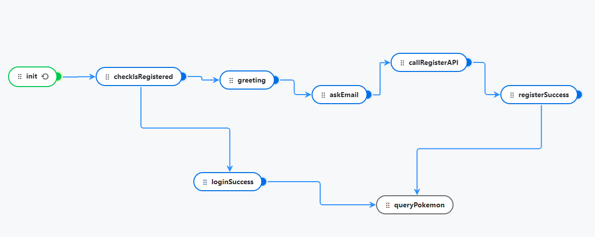

# About

Pokemon BE for kata.ai test

Note: In this interation, the chatbot will **only work in telegram**

## Chatbot Flow



Intially the chatbot will check if our user is registered by calling our service Login API with the `channel_username` and `channel_type` data.
If the user is already registered it will return success and the user will be able to start querying pokemon.

Otherwise, the chatbot will ask for name and email as well as get `channel_username` (ie. username in telegram) and `channel_type`
data by retriveing it from `metadata` object and submit it to our Register API.

## Installation

Ensure you have the following installed
- Docker
- docker-compose
- ngrok (for tunneling)

To setup `ngrok` follow this [tutorial](https://ngrok.com/docs/getting-started/?os=windows)

Since this service is not deployed, in order to access this service from kata.ai platform we will need to start the service locally and use `ngrok` for tunneling to enable public access.

After installing `ngrok` run the following command to start up the db and service
```bash
 docker-compose up
```
    
Then run the following command to enable tunneling so your service is publicly accessible
```bash
 ngrok http http://localhost:8081
```

You will receive a url to access your service for example `https://2ecd-180-254-68-187.ngrok-free.app`

Use this URL as value for the key `pokemonBEURL` in kata.ai platform config. After setting the config deploy chat bot.

You can access the bot using the following link

````
t.me/Katapokemon_bot
````

## Architecture

You can view the high level architecture [here](https://docs.google.com/document/d/1deJrplqLJ8QGyYABiC_1I-vAdSWDYoVGufBqZl9KfT8/edit?usp=sharing) 
## API Reference

#### Register User

```http
  POST /api/v1/user/register
```

| Parameter | Type     | Description                |
| :-------- | :------- | :------------------------- |
| `name` | `string` | **Required** |
| `email`      | `string` | **Required** |
| `channel_username` | `string` | **Required** |
| `channel_type`     | `string` | **Required** |

#### Login

```http
  POST /api/v1/user/login
```

| Parameter          | Type     | Description                       |
|:-------------------| :------- | :-------------------------------- |
| `channel_username` | `string` | **Required** |
| `channel_type`     | `string` | **Required** |


## Demo

https://drive.google.com/file/d/1t2fJnyEHE7Ad-zDKra2DGd8F4OlO0MnG/view?usp=sharing

## Bot
You can access the bot by using the following link. **Ensure** you already follow the installation steps before accessing

````
t.me/Katapokemon_bot
````